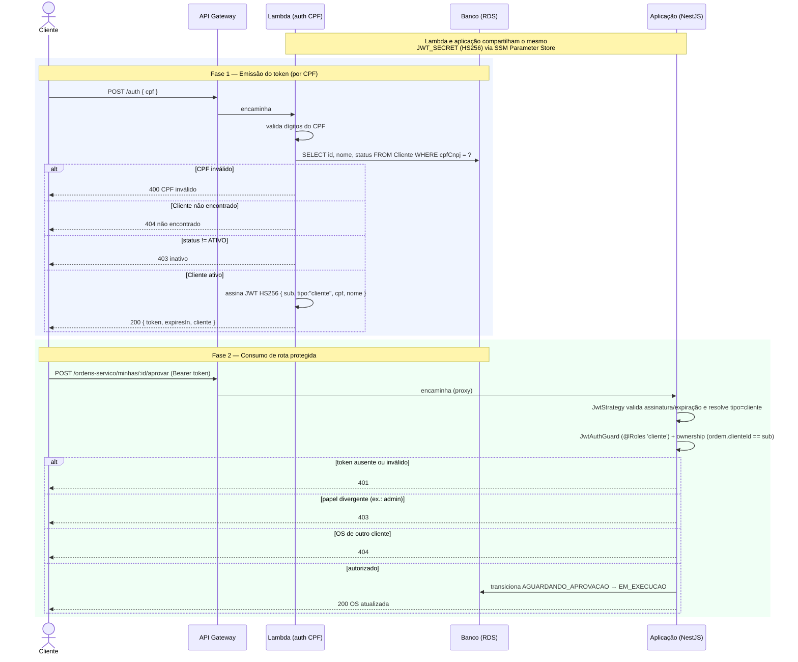

# RFC-001 — Estratégia de autenticação

| | |
|---|---|
| **Status** | Aceita |
| **Data** | 2026-08-31 |
| **Autores** | Equipe SOAT Oficina |
| **Repositórios afetados** | `fase3-app` (esta aplicação), `fase3-lambda-auth-cpf` (função serverless), `fase3-infra-database` / `fase3-infra-k8s` (SSM/segredo) |
| **Relacionados** | [ADR-001 — Ator da trilha de auditoria](../adr/ADR-001-ator-trilha-auditoria.md) |

## 1. Contexto e problema

Na Fase 2, a aplicação tinha **um único** mecanismo de autenticação: login por **email + senha** dos usuários internos, emitindo um JWT que protegia todos os endpoints.

A Fase 3 introduz um novo requisito: **o cliente da oficina** acessa rotas sensíveis autenticando-se **pelo CPF**, através de uma **função serverless** exposta em um API Gateway. Regras do enunciado (confirmadas com a coordenação):

- A autenticação por CPF via função serverless é destinada ao **cliente**.
- Os **usuários internos** (atendentes, mecânicos, administradores) usam o mecanismo próprio da aplicação (email + senha), com controle de acesso por papéis.
- A autenticação do cliente por CPF protege as rotas que acessam informações ou executam ações sensíveis do cliente — em especial a **consulta da própria OS** e, **principalmente, a aprovação ou rejeição do orçamento**.
- Rotas realmente públicas (health check, acompanhamento sem dados de terceiros) permanecem públicas.

A estratégia resolve **como os dois fluxos coexistem de forma segura e verificável**, sem duplicar a lógica de autorização nem acoplar a aplicação à emissão do token de cliente.

## 2. Decisão

Modelo de **autenticação dupla com um único formato de token (JWT HS256)** e **um único ponto de autorização** na aplicação.

### 2.1 Dois emissores, um verificador

| Fluxo | Emissor do token | Credencial | Payload |
|---|---|---|---|
| **Funcionário (admin)** | A própria aplicação (`POST /auth/login`) | email + senha | `{ sub, email }` |
| **Cliente** | Função serverless (Lambda), via `POST /auth` no API Gateway | CPF | `{ sub, tipo: "cliente", cpf, nome }` |

Ambos os tokens são **JWT assinados em HS256 com o mesmo segredo**. A aplicação **valida** os dois formatos; a emissão do token de cliente é responsabilidade exclusiva da Lambda. O `sub` é sempre o identificador do principal — `usuarioId` para admin, `clienteId` para cliente.

### 2.2 Segredo compartilhado via SSM

O segredo HS256 é **gerado uma única vez no provisionamento da Lambda** (Terraform `random_password`) e publicado no **AWS SSM Parameter Store** (`/tc3-oficina/{env}/JWT_SECRET`, `SecureString`). A Lambda recebe esse valor como variável de ambiente ao ser provisionada; a aplicação consome o **mesmo** valor a partir do SSM. Assim, ambos assinam/validam com o mesmo segredo, sem endpoint de chaves públicas (JWKS): como o algoritmo é simétrico, o segredo é o único material criptográfico e permanece no provedor de segredos.

### 2.3 Distinção de perfil e autorização

A aplicação resolve o perfil e aplica o controle de acesso em três peças:

1. **`JwtStrategy`** (`passport-jwt`): valida assinatura/expiração e traduz o payload em um `AuthenticatedUser`:
   - `payload.tipo === "cliente"` → `{ id: sub, tipo: "cliente", cpf, nome }`
   - senão, se há `payload.email` → `{ id: sub, tipo: "admin", email }`
   - caso contrário → `401`.
2. **`JwtAuthGuard`** + decorator **`@Roles(...)`**: sem `@Roles`, a rota exige `admin` (rotas administrativas fechadas ao cliente por padrão); `@Roles('cliente')` libera as rotas de cliente. Papel divergente → `403`.
3. **Verificação de propriedade (ownership)** nos _use cases_ de cliente: a OS só é acessada/alterada quando `ordem.clienteId === sub`. OS de terceiros → `404` (não se revela a existência do recurso).

### 2.4 Superfície protegida

| Rota | Proteção |
|---|---|
| `POST /auth/login` | pública (emite token admin) |
| `POST /auth` (API Gateway → Lambda) | pública (emite token de cliente) |
| `GET /ordens-servico/minhas` | `cliente` + ownership |
| `GET /ordens-servico/minhas/:id` | `cliente` + ownership |
| `POST /ordens-servico/minhas/:id/aprovar` | `cliente` + ownership |
| `POST /ordens-servico/minhas/:id/rejeitar` | `cliente` + ownership |
| Demais rotas de OS e CRUDs administrativos | `admin` (padrão) |
| `GET /public/ordens-servico/:codigo?placa=` | pública (consulta sem dados de terceiros) |
| `POST /webhooks/orcamento` | token de integração (`X-Webhook-Token`), ator máquina-a-máquina |

### 2.5 Fluxo de autenticação (diagrama de sequência)

O diagrama cobre as duas fases: a **emissão** do token pelo cliente (via Lambda) e o **consumo** de uma rota protegida na aplicação.

Desfechos da **emissão** (Lambda):

| Situação | Resposta |
|---|---|
| CPF com dígitos inválidos | `400` |
| Cliente não encontrado | `404` |
| Cliente encontrado, mas `status != ATIVO` | `403` |
| Cliente ativo | `200` + `{ token, expiresIn, cliente }` (JWT HS256) |
| Falha ao consultar o banco | `500` |

## 3. Alternativas consideradas

### 3.1 Amazon Cognito para o cliente
Gerenciar o cliente como usuário do Cognito (User Pool) e emitir tokens RS256 validados por JWKS.
- **Contra:** o cliente **já existe** como entidade de negócio no banco (com CPF e `status`); espelhá-lo no Cognito duplica a fonte de verdade e adiciona sincronização. O "login" é só CPF (sem senha/MFA), então o valor agregado do Cognito é baixo, ao custo de mais um serviço e mais um formato de token para a aplicação validar.
- **Descartada** em favor da Lambda custom, que consulta diretamente o cliente e reaproveita o mesmo formato/segredo HS256.

### 3.2 RS256 + JWKS (par de chaves assimétrico)
A Lambda assinaria com chave privada e a aplicação validaria pela chave pública publicada num JWKS.
- **Prós:** rotação de chave sem compartilhar segredo; o verificador nunca detém material de assinatura.
- **Contra:** mais complexidade operacional (endpoint e cache de JWKS, gestão do par) para um cenário de **um único emissor de confiança** já dentro da mesma conta/VPC. O ganho não se justifica no escopo atual.

### 3.3 Sessão/token opaco com introspecção
Token opaco validado a cada request contra a Lambda/banco.
- **Contra:** custo por request e acoplamento; perde a validação _stateless_ do JWT. Descartada.

## 4. Consequências

### Positivas
- **Um só ponto de autorização** (`JwtAuthGuard` + `@Roles`) e **um só formato de token** — a aplicação não sabe (nem precisa saber) _como_ o cliente provou o CPF.
- **Baixo acoplamento:** trocar a Lambda por outro emissor exige apenas manter o formato do payload e o segredo. A aplicação não muda.
- **Separação clara de perfis** por claim, atendendo ao enunciado (clientes por CPF; funcionários por email/senha com papéis).
- **Custo serverless:** sem senha para o cliente, sem serviço de identidade adicional.

### Negativas / riscos
- **Segredo simétrico compartilhado:** quem detém o segredo pode forjar qualquer token (admin ou cliente). Mitigado por manter o segredo em SSM `SecureString`, fora de código/imagem, com acesso por IAM.
- **Rotação exige coordenação:** trocar o segredo invalida tokens vivos e precisa ser aplicado na Lambda e na aplicação ao mesmo tempo. Aceitável dado o TTL curto do token.
- **CPF como único fator do cliente:** o acesso do cliente se apoia na posse do CPF (dado semipúblico) somada à verificação de `status` ativo na emissão e ao _ownership_ na aplicação. A confidencialidade do token depende do segredo compartilhado.
